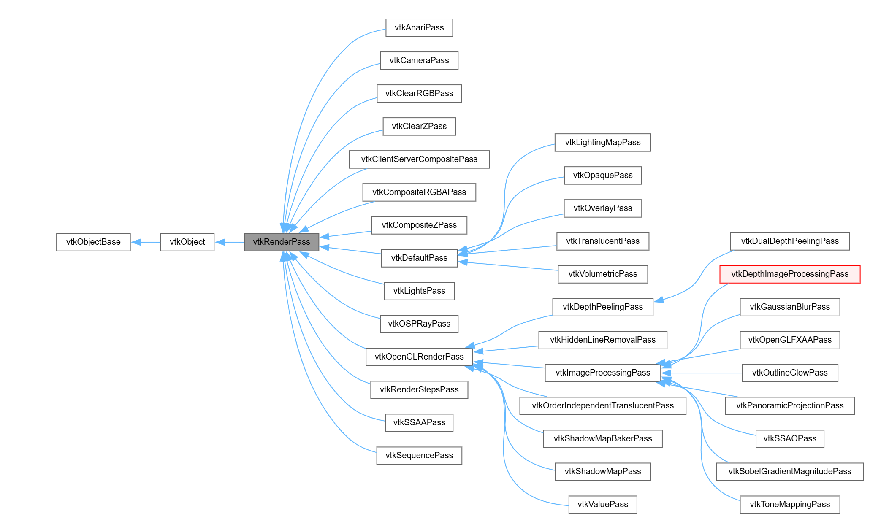

# vtk 2D 绘图

## vtk中对polyDataMapper的选择

在vtk中我们一般创建mapper时会使用

```c++
vtkSmartPointer<vtkPolyDataMapper> mapper = vtkSmartPointer<vtkPolyDataMapper>::New()
```

在这行代码中并没有指定使用OpenGL，但是vtk会动态的自动选择我们使用的vtk后端的渲染引擎例如OpenGL，可以通过打印`className()`
获取对应的类名

在vtkOpenGLPolyDataMapper2D中如果我们使用了

```c++
actor->GetProperty()->SetLineWidth()
```

并且绘制的data为LINES时会启动Geometry Shader将Line扩展为四边形也就是在Geometry
Shader会根据线段扩展为Triangle_Strip,和在OpenGL中设置的方式一样，不过不要使用OpenGL的glLineWidth，这个已经过时。

在vtk中重新对OpenGL做了封装，OpenGL的对应的概念都可以从VTK中找到，

<div style="border: 3px solid #5b2bdd; padding: 10px;">

- vtkOpenGLBufferObject
    - vtkOpenGLIndexBufferObject
    - vtkOpenGLVertexBufferObject
- vtkShaderProgram
- vtkOpenGLVertexArrayObject
- vtkOpenGLHelper
- vtkTextureObject

</div>

在这些类中做的封装其实和我们自己封装的类是类似的，不过vtk的封装功能更丰富更完整。在多与OpenGL概念以外的一个类vtkOpenGLHelper，
这个类就是后面在各种mapper中出现的部分用于数据管理以及渲染

```c++
class VTKRENDERINGOPENGL2_EXPORT vtkOpenGLHelper
{
public:
  vtkShaderProgram* Program;
  vtkTimeStamp ShaderSourceTime;
  vtkOpenGLVertexArrayObject* VAO;
  vtkTimeStamp AttributeUpdateTime;
  int PrimitiveType;
  unsigned int ShaderChangeValue;

vtkOpenGLIndexBufferObject* IBO;

vtkOpenGLHelper();
~vtkOpenGLHelper();
void ReleaseGraphicsResources(vtkWindow* win);

private:
vtkOpenGLHelper(const vtkOpenGLHelper&) = delete;
vtkOpenGLHelper& operator=(const vtkOpenGLHelper&) = delete;
};

```

下面这段代码是vtkOpenGLPolyDataMapper2D

```c++
class vtkOpenGLPolyDataMapper2D : public vtkPolyDataMapper2D
{
public:
  ...
  // The VBO and its layout.
  vtkOpenGLVertexBufferObjectGroup* VBOs;

  // Structures for the various cell types we render.
  vtkOpenGLHelper Points;
  vtkOpenGLHelper Lines;
  vtkOpenGLHelper Tris;
  vtkOpenGLHelper TriStrips;
  vtkOpenGLHelper* LastBoundBO;

  vtkTextureObject* CellScalarTexture;
  vtkOpenGLBufferObject* CellScalarBuffer;
  bool HaveCellScalars;
  int PrimitiveIDOffset;

  ...
};

VTK_ABI_NAMESPACE_END
#endif
```

下面代码是3D的poly Data Mapper

```c++
class vtkOpenGLPolyDataMapper : public vtkPolyDataMapper
{
public:
  ...
  // The VBO and its layout.
  vtkOpenGLVertexBufferObjectGroup* VBOs;

  // Structures for the various cell types we render.
  vtkOpenGLHelper Primitives[PrimitiveEnd];
  vtkOpenGLHelper SelectionPrimitives[PrimitiveEnd];
  vtkOpenGLHelper* LastBoundBO;
  ...

  vtkTextureObject* CellScalarTexture;
  vtkOpenGLBufferObject* CellScalarBuffer;
  vtkTextureObject* CellNormalTexture;
  vtkOpenGLBufferObject* CellNormalBuffer;

  vtkTextureObject* EdgeTexture;
  vtkOpenGLBufferObject* EdgeBuffer;
...

#endif

```

当然实际的代码是更复杂的。从上述的代码我们也可以看到vtk封装的完整性和健壮性以及我们也可以利用上述代码自己完成mapper的绘制

## vtk的两套绘图系统

vtk中有两套绘图系统，一套使用vtkContextItem和vtkContextScene用于图标的绘制，这里一般是用于科学绘图，类似于python的
`matlibplot`库。第二套系统就是3D和2D的图形绘制，在图形渲染中使用最多的一般是第二套，第一套的功能大部分使用的都是Qt的控
件实现的，不过第一套也是可以研究的，这样统一渲染步骤，会减少一部分由于组件兼容性导致的问题。

## vtk中的vtkProperty

先从OpenGL说起，对于每一个顶点我们一般会附着属性，这些属性包括纹理坐标、颜色等等，这些在vtk中对应于vtkProperty,不过这个
在vtk中比较奇葩的是通过vtkxxxArray的类型xxx和Component的个数来决定的，比如我们想要设置颜色

```c++
vtkSmartPointer<vtkUnsignedCharArray> array = vtkSmartPointer<vtkUnsignedCharArray>::New();
```

这时设置的颜色要使用[0,255]来设置,如果我们使用vtkFloatArray,那么我们需要在[0,1]设置。另外vtk不通过name来区分属性而是
通过分量的个数来区分，比如说

```c++
array->SetNumberOfComponent(3);
```

用于标识颜色，一个vtkPolyData中可以附加多个array,但是每次仅可启用一个scalars

```c++
polydata.GetPointData().SetActiveScalars("Temperature")
```

## OpenGL的纹理buffer

Buffer Texture 是 OpenGL 中一种特殊的纹理类型，它直接绑定到一个 buffer object（如 SSBO 或 texture buffer），
允许在 shader 中通过 texelFetch 随机访问大量数据

```glsl
uniform samplerBuffer colorBuffer;

void main()
{
    int index = gl_VertexID;
    vec4 color = texelFetch(colorBuffer, index);// 读取第 index 个 RGBA 值
...
}
```

和textureObject不同，texture buffer无法使用texture采样方法，只能通过texelFetch或者samplerBuffer进行获取纹素

| 目标	                        | 方法                                                                                                                                                                                                                         |
|----------------------------|----------------------------------------------------------------------------------------------------------------------------------------------------------------------------------------------------------------------------|
| 从 2D 纹理读取指定像素（无插值）         | 	texelFetch(sampler2D, ivec2(x,y), 0)                                                                                                                                                                                      |
| 从 Buffer Texture 读取第 N 个元素 | 	texelFetch(samplerBuffer, N)                                                                                                                                                                                              |
| 创建 Buffer Texture（C++）     | 	cpp<br>glGenBuffers(1, &buf);<br>glBindBuffer(GL_TEXTURE_BUFFER, buf);<br>glBufferData(...);<br>glGenTextures(1, &tex);<br>glBindTexture(GL_TEXTURE_BUFFER, tex);<br>glTexBuffer(GL_TEXTURE_BUFFER, GL_RGBA32F, buf);<br> |

在vtk中一般使用这种方式传递各种属性，例如颜色

## Shader宏定义

在Shader中同样可以使用和c++一样的宏定义，glsl明确支持下面宏

| 指令                                         | 	说明                                                              |
|--------------------------------------------|------------------------------------------------------------------|
| #define	                                   | 定义宏（对象式或函数式）                                                     |
| #undef	                                    | 取消定义宏                                                            |
| #if, #ifdef, #ifndef, #else, #elif, #endif | 	条件编译                                                            |
| #error	                                    | 输出编译错误                                                           |
| #pragma	                                   | 编译器指令（如 #pragma optimize(off)，但支持程度依赖驱动）                         |
| #extension	                                | 启用 OpenGL 扩展（如 #extension GL_ARB_texture_buffer_object : enable） |

```glsl
#ifdef DEBUG
#define DBG_COLOR(col) gl_FragColor = col
#else
#define DBG_COLOR(col)
#endif

void main() {
    DBG_COLOR(vec4(1,0,0,1));// 仅在 DEBUG 模式下生效
}

```

## vtkCellArray的布局

在vtk 9.0之后和之前的布局是不同的，现在一般使用的都是9.0以上的版本的，所以只记录9.0以上的布局方式
vtkCellArray中的数据使用两个数组记录，一个是connectivity，一个是offsets，在connectivity中
记录了所有的顶点，而在offsets中记录的是图元顶点的偏移

例如：

<div style="border: 3px solid #5b2bdd; padding: 10px;">
- 单元 0：三角形 → 点 [10, 20, 30]<br>
- 单元 1：线段 → 点 [5, 15]
</div>

- 单元 0：从 offsets[0]=0 到 offsets[1]=3 → 取 conn[0:3] = [10,20,30]
- 单元 1：从 offsets[1]=3 到 offsets[2]=5 → 取 conn[3:5] = [5,15]

```c++
vtkNew<vtkCellArray> cells;

// 方法1：通过 InsertNextCell
vtkIdType tri[3] = {10, 20, 30};
vtkIdType line[2] = {5, 15};
cells->InsertNextCell(3, tri);
cells->InsertNextCell(2, line);

// 方法2：直接设置数组（高效）
vtkNew<vtkIdTypeArray> offsets;
offsets->SetNumberOfValues(3);
offsets->SetValue(0, 0);
offsets->SetValue(1, 3);
offsets->SetValue(2, 5);

vtkNew<vtkIdTypeArray> conn;
conn->SetNumberOfValues(5);
conn->SetValue(0, 10);
conn->SetValue(1, 20);
conn->SetValue(2, 30);
conn->SetValue(3, 5);
conn->SetValue(4, 15);

cells->SetData(offsets, conn); // 关键！
```

## SSBO

SSBO（Shader Storage Buffer Object）和 CUDA 的全局内存（Global Memory）都是 GPU 上用于大容量、可读写数据存储的机制，但它们属于不同的并
行计算框架（OpenGL vs. CUDA），在使用方式、内存模型、性能特征和适用场景上有显著区别。

### SSBO（OpenGL）

- 是 OpenGL 中的一种 Buffer Object，绑定到 GL_SHADER_STORAGE_BUFFER 目标。
- 在 GLSL 中通过 buffer 块声明：

```glsl
layout(std430, binding = 0) buffer MyData {
    float values[];
};
```

## vtk中的visit

vtk中的visit其实就是类型的特化，根据特化的不同类型执行不同的逻辑

```c++
template<itk::ImageIOBase::IOComponentType VComponent>
struct ComponentToCxxType;

template<> struct ComponentToCxxType<itk::ImageIOBase::UCHAR> { using Type = unsigned char; };
template<> struct ComponentToCxxType<itk::ImageIOBase::USHORT> { using Type = unsigned short; };
template<> struct ComponentToCxxType<itk::ImageIOBase::FLOAT> { using Type = float; };
template<> struct ComponentToCxxType<itk::ImageIOBase::SHORT> { using Type = short; };

template<typename TPixel>
std::string DicomReadReader::doReadData(
	const itk::GDCMSeriesFileNames::FileNamesContainerType& fileNames,
	DicomSeries* dicomSeries)
{
	using OutputImageType = itk::Image<TPixel, 3>;
	using ReaderType = itk::ImageSeriesReader<OutputImageType>;
	auto reader = ReaderType::New();
	reader->SetFileNames(fileNames);
	auto gdcmIO = itk::GDCMImageIO::New();
	reader->SetImageIO(gdcmIO);
	gdcmIO->LoadPrivateTagsOn();
	gdcmIO->KeepOriginalUIDOn();

	try
	{
		reader->Update();
		OutputImageType::Pointer image = reader->GetOutput();
		dicomSeries->parseInfo(gdcmIO->GetMetaDataDictionary());
		dicomSeries->GetImageInfo()->SetVolume<TPixel>(image);
	}
	catch (itk::ExceptionObject& e)
	{
		return std::string("failed to read dicom series: ") + e.what();
	}

	return "";
}

std::string DicomReadReader::dispatchRead(
	itk::ImageIOBase::IOComponentType VComponent,
	const itk::GDCMSeriesFileNames::FileNamesContainerType& fileNames,
	DicomSeries* series)
{
	switch (VComponent)
	{
	case itk::ImageIOBase::UCHAR:
		return doReadData<ComponentToCxxType<itk::ImageIOBase::UCHAR>::Type>(fileNames, series);
		break;
	case itk::ImageIOBase::USHORT:
		return doReadData<ComponentToCxxType<itk::ImageIOBase::UCHAR>::Type>(fileNames, series);
		break;
	case itk::ImageIOBase::SHORT:
		return doReadData<ComponentToCxxType<itk::ImageIOBase::SHORT>::Type>(fileNames, series);
		break;
	case itk::ImageIOBase::FLOAT:
		return doReadData<ComponentToCxxType<itk::ImageIOBase::FLOAT>::Type>(fileNames, series);
		break;
	default:
		throw std::runtime_error("not supprt datatype");
		break;
	}
}

```

## vtk的NDC和OpenGL的概念对比

vtk的NDC是对用户而言的并不是最终底层OpenGL使用的NDC范围，在vtk中NDC的范围为[0, 1],而在OpenGL中的范围为[-1,1]

## vtk中的picking实现

vtk中的picking的实现是通过单次pass来实现的。基本原理如下
- 基于颜色编码的 Picking
这种方法涉及给每个可选对象分配一个唯一颜色，并在执行 picking 操作时，通过读取点击位置的颜色值来识别被点击的对象。

1. 配唯一颜色：为场景中的每个对象分配一个唯一的颜色ID。这个颜色ID应该保证在整个场景中是独一无二的。

2. 渲染Picking Buffer：创建一个离屏缓冲区（off-screen buffer），然后用这些唯一颜色渲染场景到该缓冲区。注意，在此过程中不要应用任何材质或光照计算，只需渲染对象的固有颜色。

3. 读取颜色值：当用户点击时，根据鼠标坐标从picking buffer中读取对应像素的颜色值。

4. 映射到对象：将读取的颜色值映射回原始对象，以确定用户选择了哪个对象。
这种方法的优点在于简单直接，但缺点是颜色精度限制了可以区分的对象数量。

具体的实现为

1. 根据是否在renderer中创建了selector决定是否开启 picking pass
```c++
void vtkOpenGLPolyDataMapper2D::BuildShaders(std::string& VSSource, std::string& FSSource,
  std::string& GSSource, vtkViewport* viewport, vtkActor2D* actor)
{
	...
  vtkRenderer* ren = vtkRenderer::SafeDownCast(viewport);
  if (ren && ren->GetSelector())
  {
    this->ReplaceShaderPicking(FSSource, ren, actor);
  }
}

void vtkOpenGLPolyDataMapper2D::ReplaceShaderPicking(
  std::string& fssource, vtkRenderer*, vtkActor2D*)
{
  vtkShaderProgram::Substitute(fssource, "//VTK::Picking::Dec", "uniform vec3 mapperIndex;");
  vtkShaderProgram::Substitute(
    fssource, "//VTK::Picking::Impl", "gl_FragData[0] = vec4(mapperIndex,1.0);\n");
}
```

可以看到vtk的picking是通过颜色来的，在老版本中`gl_FragData[0]`就是现在使用的`gl_FragColor`，不过最新的OpenGL版本也不再使用`gl_FragColor`这种方式，而是使用自定义的out变量

通过将一个PrimitiveIDOffset进行编码为一个颜色，并将其设置到uniform mapperIndex

```c++
void vtkCompositeMapperHelper2::RenderPieceDraw(vtkRenderer* ren, vtkActor* actor)
{
	...
  if (this->CurrentSelector &&
    (this->CurrentSelector->GetCurrentPass() == vtkHardwareSelector::CELL_ID_LOW24 ||
      this->CurrentSelector->GetCurrentPass() == vtkHardwareSelector::CELL_ID_HIGH24))
  {
    this->CurrentSelector->SetPropColorValue(this->PrimitiveIDOffset);
  }
}

void vtkHardwareSelector::SetPropColorValue(vtkIdType val)
{
  float color[3];
  vtkHardwareSelector::Convert(val, color);
  this->SetPropColorValue(color);
}
 static void Convert(vtkIdType id, float tcoord[3])
 {
   tcoord[0] = static_cast<float>((id & 0xff) / 255.0);
   tcoord[1] = static_cast<float>(((id & 0xff00) >> 8) / 255.0);
   tcoord[2] = static_cast<float>(((id & 0xff0000) >> 16) / 255.0);
 }

   if (selector && cellBO.Program->IsUniformUsed("mapperIndex"))
  {
    cellBO.Program->SetUniform3f("mapperIndex", selector->GetPropColorValue());
  }
```

这个mapperIndex在picking pass中是作为颜色填充每个图元的位置的

```glsl
uniform vec3 mapperIndex;  // ← 来自 Substitute(...Dec)

void main() {
    gl_FragData[0] = vec4(mapperIndex, 1.0);  // ← 来自 Substitute(...Impl)
}
```
这是替换完成后的fragment shader，在vtk中每次绘制并不是以单个图元（LINES, TRIANGLES等）作为绘制单位，而是以actor中存储的整个物体的所有图元进行一次绘制，这就和OpenGL的实例化很像的，不过还并不是所有数据一次传输，因为这些物体并不是都一致的，这也是PrimitiveIDOffset的意义，每次偏移都是以物体的IBO的总数为单位进行的偏移

```c++
void vtkOpenGLPolyDataMapper2D::RenderOverlay(vtkViewport* viewport, vtkActor2D* actor)
{
  ...
  // Figure out and build the appropriate shader for the mapped geometry.
  this->PrimitiveIDOffset = 0;
  ...
  if (this->Points.IBO->IndexCount && actor->GetProperty()->GetPointSize() != 0.f)
  {
    ...
    this->PrimitiveIDOffset += (int)this->Points.IBO->IndexCount;
  }

  if (this->Lines.IBO->IndexCount && actor->GetProperty()->GetLineWidth() != 0.f)
  {
    ...
    this->PrimitiveIDOffset += (int)this->Lines.IBO->IndexCount / 2;
  }

  // now handle lit primitives
  if (this->Tris.IBO->IndexCount)
  {
    ...
      this->PrimitiveIDOffset += (int)this->Tris.IBO->IndexCount / 3;
    }
  }
...

}
```

经过上述步骤后，将所有物体的颜色绘制到一张framebuffer上，然后根据鼠标位置找到对应的颜色，再执行反向的转换即可得到目标的图元偏移，也就是物体的id

```c++
// Also store the prop zvalues here as we traverse the images
void vtkHardwareSelector::BuildPropHitList(unsigned char* pixelbuffer)
{
 ...

  unsigned int offset = 0;
  for (int yy = 0; yy <= static_cast<int>(this->Area[3] - this->Area[1]); yy++)
  {
    for (int xx = 0; xx <= static_cast<int>(this->Area[2] - this->Area[0]); xx++)
    {
      int val = this->Convert(xx, yy, pixelbuffer);
      if (val > 0)
      {
        val -= ID_OFFSET;
        if (this->Internals->HitProps.find(val) == this->Internals->HitProps.end())
        {
          this->Internals->HitProps.insert(val);
          ...
        }
        ...
      }
    }
  }
}

int Convert(int xx, int yy, unsigned char* pb)
{
  if (!pb)
  {
    return 0;
  }
  int offset = (yy * static_cast<int>(this->Area[2] - this->Area[0] + 1) + xx) * 3;
  unsigned char rgb[3];
  rgb[0] = pb[offset];
  rgb[1] = pb[offset + 1];
  rgb[2] = pb[offset + 2];
  int val = 0;
  val |= rgb[2];
  val = val << 8;
  val |= rgb[1];
  val = val << 8;
  val |= rgb[0];
  return val;
}
```

## vtk中的render pass

render pass并不是vtk中的概念，而是现代图形学中使用的概念，通过多次渲染以实现更加复杂的效果，每一次执行的render pass都是一次完整的图形管线，例如上面的picking pass，也是通过顶点着色器->片段着色器->framebuffer。当然在vtk中还有很多已经完成的pass



但是这些并不是每一个版本都有的，而且在不断的更新

## vtk中的piece概念
在 VTK（Visualization Toolkit）中，`vtkPolyDataMapper` 的 **`Piece`** 是一个用于**数据分块（partitioning）和并行渲染**的概念，它与 `NumberOfPieces` 和 `GhostLevel` 一起控制 mapper 如何处理输入的 `vtkPolyData` 数据。

---

### 📌 核心概念

#### 1. **`Piece`（当前分块索引）**
- 类型：`int`
- 默认值：`0`
- 含义：指定当前 mapper 应该渲染输入数据的**第几块（piece）**。
- 范围：`0 ≤ Piece < NumberOfPieces`

#### 2. **`NumberOfPieces`（总分块数）**
- 默认值：`1`
- 含义：将整个数据集划分为多少个逻辑块。

#### 3. **`GhostLevel`（幽灵层深度）**
- 用于在分块边界添加额外单元，避免渲染裂缝（尤其在分布式/并行渲染中）。

---

### 🔍 为什么需要 `Piece`？

VTK 支持 **并行处理和分布式渲染**（例如使用 MPI 或多 GPU）。在这种场景下：

- 一个大型 `vtkPolyData` 被**分割成多个 pieces**（分块）
- 每个进程/线程只处理 **一个 piece**
- 每个进程创建自己的 `vtkPolyDataMapper`，并设置：
  ```cpp
  mapper->SetPiece(my_rank);           // 当前进程负责第 my_rank 块
  mapper->SetNumberOfPieces(num_procs); // 总共 num_procs 块
  ```
- 最终合成完整图像

> 💡 即使在单机单线程程序中，VTK 内部某些 filter（如 `vtkExtractPolyDataPiece`）也会利用 `Piece` 机制进行数据子集提取。

---

### ✅ 典型使用场景

#### 场景 1：并行渲染（MPI）
```cpp
// 假设有 4 个 MPI 进程
int my_rank = ...; // 0, 1, 2, or 3
int num_procs = 4;

vtkNew<vtkPolyDataMapper> mapper;
mapper->SetInputData(polydata);
mapper->SetPiece(my_rank);
mapper->SetNumberOfPieces(num_procs);
mapper->SetGhostLevel(1); // 避免边界裂缝

vtkNew<vtkActor> actor;
actor->SetMapper(mapper);
```
→ 每个进程只渲染数据的 1/4。

#### 场景 2：单机上手动分块渲染（较少见）
```cpp
// 只渲染数据的前半部分
mapper->SetNumberOfPieces(2);
mapper->SetPiece(0); // 取第 0 块（前半）
```

---

### ⚠️ 重要注意事项

1. **输入数据必须支持分块**  
   并非所有 `vtkPolyData` 都能自动分块。通常需要上游 filter（如 `vtkDistributedDataFilter`、`vtkExtractPolyDataPiece`）生成带 `vtkOriginalCellIds` 或 `vtkGhostType` 的分块数据。

2. **默认行为（Piece=0, NumberOfPieces=1）**  
   表示“使用全部数据”，这是绝大多数单机应用的情况。

3. **与 `vtkActor` 的关系**  
   `Piece` 是 **mapper 级别**的设置，不影响 actor 的变换或属性。

4. **不等于 LOD（Level of Detail）**  
   `Piece` 是空间/数据分块，不是细节层次。

---