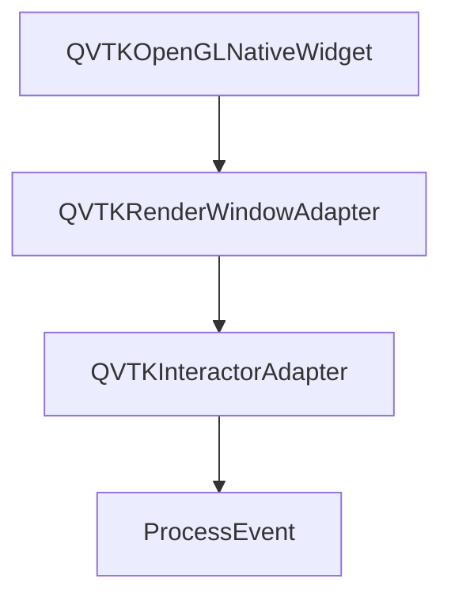

# 一、vtkRenderWindowInteractor功能

在vtkRenderWindowInteractor中并没有特别多的内容主要是开启绘制的作用，所有的具体交互内容都在QVTKOpenGLNativeWidget的adapter中。

```c++
void vtkRenderWindowInteractor::Start()
{
  // Let the compositing handle the event loop if it wants to.
  if (this->HasObserver(vtkCommand::StartEvent) && !this->HandleEventLoop)
  {
    this->InvokeEvent(vtkCommand::StartEvent, nullptr);
    return;
  }

  // As a convenience, initialize if we aren't initialized yet.
  if (!this->Initialized)
  {
    this->Initialize();

    if (!this->Initialized)
    {
      return;
    }
  }

  // Pass execution to the subclass which will run the event loop,
  // this will not return until TerminateApp is called.
  this->Done = false;
  this->StartEventLoop();
}

void vtkRenderWindowInteractor::Initialize()
{
  this->Initialized = 1;
  this->Enable();
  this->Render();
}

void vtkRenderWindowInteractor::Render()
{
  if (this->RenderWindow && this->Enabled && this->EnableRender)
  {
    this->RenderWindow->Render();
  }
  // outside the above test so that third-party code can redirect
  // the render to the appropriate class
  this->InvokeEvent(vtkCommand::RenderEvent, nullptr);
}

void vtkRenderWindow::Render()
{
  // if we are in the middle of an abort check then return now
  if (this->InAbortCheck)
  {
    return;
  }

  // if we are in a render already from somewhere else abort now
  if (this->InRender)
  {
    return;
  }

  // if SetSize has not yet been called (from a script, possible off
  // screen use, other scenarios?) then call it here with reasonable
  // default values
  if (0 == this->Size[0] && 0 == this->Size[1])
  {
    this->SetSize(300, 300);
  }

  // reset the Abort flag
  this->AbortRender = 0;
  this->InRender = 1;

  vtkDebugMacro(<< "Starting Render Method.\n");
  this->InvokeEvent(vtkCommand::StartEvent, nullptr);

  this->NeverRendered = 0;

  if (this->Interactor && !this->Interactor->GetInitialized())
  {
    this->Interactor->Initialize();
  }

  this->Start(); // Ensure context exists
  vtkRenderTimerLog::ScopedEventLogger event;
  if (this->RenderTimer->GetLoggingEnabled())
  {
    this->RenderTimer->MarkFrame();
    event = this->RenderTimer->StartScopedEvent("vtkRenderWindow::Render");
  }

  this->DoStereoRender();

  this->End(); // restores original bindings

  this->CopyResultFrame();

  // reset the buffer size without freeing any memory.
  this->ResultFrame->Reset();

  // Stop the render timer before invoking the EndEvent.
  event.Stop();

  this->InRender = 0;
  this->InvokeEvent(vtkCommand::EndEvent, nullptr);
}

void vtkRenderWindow::DoStereoRender()
{
  vtkCollectionSimpleIterator rsit;

  this->StereoUpdate();

  if (!this->StereoRender || (this->StereoType != VTK_STEREO_RIGHT))
  { // render the left eye
    vtkRenderer* aren;
    for (this->Renderers->InitTraversal(rsit); (aren = this->Renderers->GetNextRenderer(rsit));)
    {
      // Ugly piece of code - we need to know if the camera already
      // exists or not. If it does not yet exist, we must reset the
      // camera here - otherwise it will never be done (missing its
      // oppportunity to be reset in the Render method of the
      // vtkRenderer because it will already exist by that point...)
      if (!aren->IsActiveCameraCreated())
      {
        aren->ResetCamera();
      }
      aren->GetActiveCamera()->SetLeftEye(1);
    }
    this->Renderers->Render();
  }

  if (this->StereoRender)
  {
    this->StereoMidpoint();
    if (this->StereoType != VTK_STEREO_LEFT)
    { // render the right eye
      vtkRenderer* aren;
      for (this->Renderers->InitTraversal(rsit); (aren = this->Renderers->GetNextRenderer(rsit));)
      {
        // Duplicate the ugly code here too. Of course, most
        // times the left eye will have been rendered before
        // the right eye, but it is possible that the user sets
        // everything up and renders just the right eye - so we
        // need this check here too.
        if (!aren->IsActiveCameraCreated())
        {
          aren->ResetCamera();
        }
        if (this->StereoType != VTK_STEREO_FAKE)
        {
          aren->GetActiveCamera()->SetLeftEye(0);
        }
      }
      this->Renderers->Render();
    }
    this->StereoRenderComplete();
  }
}

```

## 1.1 立体渲染支持

渲染的主框架在vtkRenderWindow中，渲染方法的名字很奇怪叫`DoStereoRender`，整个的渲染框架是将普通的3D渲染作为立体渲染的左眼进行的，在立体渲染中存在两个相机LeftEye和RightEye，这两个Eye其实就是模仿人眼间距而加入的两个相机，借助其他硬件从而形成的立体视觉，在立体渲染中支持多种渲染方式
```c++
#define VTK_STEREO_CRYSTAL_EYES 1
#define VTK_STEREO_RED_BLUE 2
#define VTK_STEREO_INTERLACED 3
#define VTK_STEREO_LEFT 4
#define VTK_STEREO_RIGHT 5
#define VTK_STEREO_DRESDEN 6
#define VTK_STEREO_ANAGLYPH 7
#define VTK_STEREO_CHECKERBOARD 8
#define VTK_STEREO_SPLITVIEWPORT_HORIZONTAL 9
#define VTK_STEREO_FAKE 10
#define VTK_STEREO_EMULATE 11
```

| 方法 | 说明 | 适用场景 |
|------|------|--------|
| `SetStereoTypeToAnaglyph()` | 红蓝/红青色分色 | 普通显示器 + 红蓝眼镜 |
| `SetStereoTypeToCrystalEyes()` | 主动快门式（需专用硬件） | NVIDIA 3D Vision 等 |
| `SetStereoTypeToLeftRight()` | 左右分屏 | VR 视频、部分头显 |
| `SetStereoTypeToTopBottom()` | 上下分屏 | 部分 VR 设备（如早期 Gear VR） |
| `SetStereoTypeToInterlaced()` | 行交错 | 专业立体显示器 |
| `SetStereoTypeToDresden()` | 特殊时序格式 | 少数科研设备 |

当然这些设置还需要对应的硬件支持
| 平台 | 要求 |
|------|------|
| **普通显示器 + Anaglyph** | 无需特殊硬件，戴红蓝眼镜即可 |
| **NVIDIA 3D Vision** | 需支持 120Hz 显示器 + 快门眼镜 + 驱动启用 |
| **VR 头显**（HTC Vive, Oculus） | 需结合 OpenXR / VTK VR 模块（如 `vtkOpenXRRenderWindow`） |
| **Linux / Windows** | VTK 均支持，但需 OpenGL 驱动支持立体上下文 |


## 1.2 vtk中和OpenGL的接口vtkOpenGLState

在VTK中的所有绘制状态的设置都需要由vtkOpenGLState来进行设置，在各种状态设置完毕后，经由glDrawXXX相关的API传递draw call命令进行绘制，对于更复杂的绘制，例如Selector还需要使用vtkOpenGLState的Push和Pop进行状态管理，避免状态污染，但是在VTK的源码中使用Push和Pop命令的相当少，只有几个RenderWindow类和Selector类中使用了这种方式，大部分的绘制都是直接获取栈顶的状态直接进行状态设置。

从设计角度来看vtkOpenGLState的主要目标是减少对相同状态的值的多次调用OpenGL的驱动来提升部分性能。

在vtkOpenGLState中包含了大部分的状态设置

```c++
class GLState
{
public:
  double ClearDepth;
  unsigned char DepthMask;
  unsigned int DepthFunc;
  unsigned int BlendEquationValue1;
  unsigned int BlendEquationValue2;
  unsigned int CullFaceMode;
  unsigned int ActiveTexture;

  float PointSize;
  float LineWidth;
  unsigned int StencilMaskFront;
  unsigned int StencilMaskBack;
  std::array<unsigned int, 3> StencilFuncFront;
  std::array<unsigned int, 3> StencilFuncBack;
  std::array<unsigned int, 3> StencilOpFront;
  std::array<unsigned int, 3> StencilOpBack;

  int PackAlignment;
  int UnpackAlignment;
  int UnpackRowLength;
  int UnpackImageHeight;

  std::array<float, 4> ClearColor;
  std::array<unsigned char, 4> ColorMask;
  std::array<int, 4> Viewport;
  std::array<int, 4> Scissor;
  std::array<unsigned int, 4> BlendFunc;
  bool DepthTest;
  bool CullFace;
  bool ScissorTest;
  bool StencilTest;
  bool Blend;
  bool MultiSample;
  bool CubeMapSeamless;
  bool LineSmooth;
  int BoundVAO;
  int BoundArrayBuffer;
  int BoundElementArrayBuffer;
  int BoundProgram;
  BufferBindingState DrawBinding;
  BufferBindingState ReadBinding;
  GLState() = default;
};
```

以及对绘制的framebuffer的管理

```c++
class VTKRENDERINGOPENGL2_EXPORT BufferBindingState
{
public:
  BufferBindingState();
  unsigned int Binding;
  unsigned int ReadBuffer;
  unsigned int DrawBuffers[10];
  unsigned int GetBinding();
  unsigned int GetDrawBuffer(unsigned int);
  unsigned int GetReadBuffer();
};
std::list<BufferBindingState> DrawBindings;
std::list<BufferBindingState> ReadBindings;
```
这里分为了两类，一部分是readBuffer，一部分是drawBuffer，也就是对应于GL_FRONT和GL_BACK的状态

当然其中还包含了对shader、VBO的cache，以减少对相同目标绘制时的shader和顶点集合的重复创建


## 1.3 Qt交互事件接入vtk 

Qt的所有交互事件经由QVTKInteractirAdapter转换，将Qt的事件转换为VTK的ObserverEvent，经过VTK的Observer系统对事件进行处理。
VTK支持了所有的交互方式，鼠标交互、键盘交互、手势交互、点击交互，并且所有的交互事件的坐标系统都已经转换为了VTK的交互坐标系，Qt的原点在左上角，VTK(屏幕坐标系)的原点在左下角

<div align="center">


</div>

```c++
  if (t == QEvent::MouseButtonPress || t == QEvent::MouseButtonRelease ||
    t == QEvent::MouseButtonDblClick || t == QEvent::MouseMove)
  {
    ...
    if (t == QEvent::MouseMove)
    {
      iren->InvokeEvent(vtkCommand::MouseMoveEvent, e2);
    }

    else if (t == QEvent::MouseButtonPress)
    {
      switch (e2->button())
      {
        case Qt::LeftButton:
          iren->InvokeEvent(vtkCommand::LeftButtonPressEvent, e2);
          break;

        case Qt::MiddleButton:
          iren->InvokeEvent(vtkCommand::MiddleButtonPressEvent, e2);
          break;

        case Qt::RightButton:
          iren->InvokeEvent(vtkCommand::RightButtonPressEvent, e2);
          break;

        default:
          break;
      }
    }
    else if (t == QEvent::MouseButtonDblClick)
    {
      switch (e2->button())
      {
        case Qt::LeftButton:
          iren->InvokeEvent(vtkCommand::LeftButtonDoubleClickEvent, e2);
          break;

        case Qt::MiddleButton:
          iren->InvokeEvent(vtkCommand::MiddleButtonDoubleClickEvent, e2);
          break;

        case Qt::RightButton:
          iren->InvokeEvent(vtkCommand::RightButtonDoubleClickEvent, e2);
          break;

        default:
          break;
      }
    }
    else if (t == QEvent::MouseButtonRelease)
    {
      switch (e2->button())
      {
        case Qt::LeftButton:
          iren->InvokeEvent(vtkCommand::LeftButtonReleaseEvent, e2);
          break;

        case Qt::MiddleButton:
          iren->InvokeEvent(vtkCommand::MiddleButtonReleaseEvent, e2);
          break;

        case Qt::RightButton:
          iren->InvokeEvent(vtkCommand::RightButtonReleaseEvent, e2);
          break;

        default:
          break;
      }
    }
    return true;
  }
  if (t == QEvent::TouchBegin || t == QEvent::TouchUpdate || t == QEvent::TouchEnd)
  {
    ...
    Q_FOREACH (const QTouchEvent::TouchPoint& point, e2->touchPoints())
    {
      if (point.id() >= VTKI_MAX_POINTERS)
      {
        break;
      }
      iren->SetPointerIndex(point.id());
      if (point.state() & Qt::TouchPointReleased)
      {
        iren->InvokeEvent(vtkCommand::LeftButtonReleaseEvent, nullptr);
      }
      if (point.state() & Qt::TouchPointPressed)
      {
        iren->InvokeEvent(vtkCommand::LeftButtonPressEvent, nullptr);
      }
      if (point.state() & Qt::TouchPointMoved)
      {
        iren->InvokeEvent(vtkCommand::MouseMoveEvent, nullptr);
      }
    }
    e2->accept();
    return true;
  }

  if (t == QEvent::Enter)
  {
    iren->InvokeEvent(vtkCommand::EnterEvent, e);
    return true;
  }

  if (t == QEvent::Leave)
  {
    iren->InvokeEvent(vtkCommand::LeaveEvent, e);
    return true;
  }

  if (t == QEvent::KeyPress || t == QEvent::KeyRelease)
  {
    QKeyEvent* e2 = static_cast<QKeyEvent*>(e);

    ...

    if (t == QEvent::KeyPress)
    {
      // invoke vtk event
      iren->InvokeEvent(vtkCommand::KeyPressEvent, e2);

      // invoke char event only for ascii characters
      if (ascii_key)
      {
        iren->InvokeEvent(vtkCommand::CharEvent, e2);
      }
    }
    else
    {
      iren->InvokeEvent(vtkCommand::KeyReleaseEvent, e2);
    }
    return true;
  }

  if (t == QEvent::Wheel)
  {
   ...

    // invoke vtk event when accumulated delta passes the threshold
    if (this->AccumulatedDelta >= threshold && verticalDelta != 0.0)
    {
      iren->InvokeEvent(vtkCommand::MouseWheelForwardEvent, e2);
      this->AccumulatedDelta = 0;
    }
    else if (this->AccumulatedDelta <= -threshold && verticalDelta != 0.0)
    {
      iren->InvokeEvent(vtkCommand::MouseWheelBackwardEvent, e2);
      this->AccumulatedDelta = 0;
    }
    else if (this->AccumulatedDelta >= threshold && horizontalDelta != 0.0)
    {
      iren->InvokeEvent(vtkCommand::MouseWheelLeftEvent, e2);
      this->AccumulatedDelta = 0;
    }
    else if (this->AccumulatedDelta <= -threshold && horizontalDelta != 0.0)
    {
      iren->InvokeEvent(vtkCommand::MouseWheelRightEvent, e2);
      this->AccumulatedDelta = 0;
    }

    return true;
  }

  if (t == QEvent::ContextMenu)
  {
    ...

    // invoke event and pass qt event for additional data as well
    iren->InvokeEvent(QVTKInteractor::ContextMenuEvent, e2);

    return true;
  }

  if (t == QEvent::DragEnter)
  {
    QDragEnterEvent* e2 = static_cast<QDragEnterEvent*>(e);

    // invoke event and pass qt event for additional data as well
    iren->InvokeEvent(QVTKInteractor::DragEnterEvent, e2);

    return true;
  }

  if (t == QEvent::DragLeave)
  {
    QDragLeaveEvent* e2 = static_cast<QDragLeaveEvent*>(e);

    // invoke event and pass qt event for additional data as well
    iren->InvokeEvent(QVTKInteractor::DragLeaveEvent, e2);

    return true;
  }

  if (t == QEvent::DragMove)
  {
    ...

    // invoke event and pass qt event for additional data as well
    iren->InvokeEvent(QVTKInteractor::DragMoveEvent, e2);
    return true;
  }

  if (t == QEvent::Drop)
  {
    ...

    // invoke event and pass qt event for additional data as well
    iren->InvokeEvent(QVTKInteractor::DropEvent, e2);
    return true;
  }

  if (e->type() == QEvent::Gesture)
  {
    ...

    if (QSwipeGesture* swipe = static_cast<QSwipeGesture*>(e2->gesture(Qt::SwipeGesture)))
    {
      ...
      switch (swipe->state())
      {
        case Qt::GestureCanceled:
        case Qt::GestureFinished:
          iren->InvokeEvent(vtkCommand::EndSwipeEvent, e2);
          break;
        case Qt::GestureStarted:
          iren->InvokeEvent(vtkCommand::StartSwipeEvent, e2);
          iren->InvokeEvent(vtkCommand::SwipeEvent, e2);
          break;
        default:
          iren->InvokeEvent(vtkCommand::SwipeEvent, e2);
      }
    }

    if (QPinchGesture* pinch = static_cast<QPinchGesture*>(e2->gesture(Qt::PinchGesture)))
    {
      ...
      switch (pinch->state())
      {
        case Qt::GestureFinished:
        case Qt::GestureCanceled:
          iren->InvokeEvent(vtkCommand::EndPinchEvent, e2);
          break;
        case Qt::GestureStarted:
          iren->InvokeEvent(vtkCommand::StartPinchEvent, e2);
          iren->InvokeEvent(vtkCommand::PinchEvent, e2);
          break;
        default:
          iren->InvokeEvent(vtkCommand::PinchEvent, e2);
      }
      ...
      switch (pinch->state())
      {
        case Qt::GestureFinished:
        case Qt::GestureCanceled:
          iren->InvokeEvent(vtkCommand::EndRotateEvent, e2);
          break;
        case Qt::GestureStarted:
          iren->InvokeEvent(vtkCommand::StartRotateEvent, e2);
          iren->InvokeEvent(vtkCommand::RotateEvent, e2);
          break;
        default:
          iren->InvokeEvent(vtkCommand::RotateEvent, e2);
      }
    }

    if (QPanGesture* pan = static_cast<QPanGesture*>(e2->gesture(Qt::PanGesture)))
    {
     ...
      switch (pan->state())
      {
        case Qt::GestureFinished:
        case Qt::GestureCanceled:
          iren->InvokeEvent(vtkCommand::EndPanEvent, e2);
          break;
        case Qt::GestureStarted:
          iren->InvokeEvent(vtkCommand::StartPanEvent, e2);
          iren->InvokeEvent(vtkCommand::PanEvent, e2);
          break;
        default:
          iren->InvokeEvent(vtkCommand::PanEvent, e2);
      }
    }

    if (QTapGesture* tap = static_cast<QTapGesture*>(e2->gesture(Qt::TapGesture)))
    {
      ...
      if (tap->state() == Qt::GestureStarted)
      {
        iren->InvokeEvent(vtkCommand::TapEvent, e2);
      }
    }

    if (QTapAndHoldGesture* tapAndHold =
          static_cast<QTapAndHoldGesture*>(e2->gesture(Qt::TapAndHoldGesture)))
    {
      ...
      if (tapAndHold->state() == Qt::GestureStarted)
      {
        iren->InvokeEvent(vtkCommand::LongTapEvent, e2);
      }
    }

    iren->SetEventPosition(eventPosition);
    iren->SetLastEventPosition(lastEventPosition);

    return true;
  }

```
