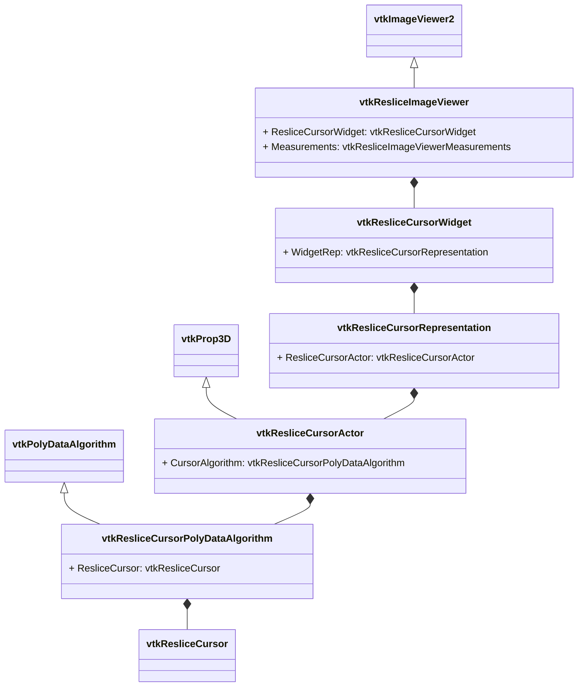

# vtkResliceImageViewer解析



## vtkPointPlacer
vtkPointPlacer可以在多种渲染内容中将2D坐标转换为3D坐标类的基类，包括多种类型点的选择方式
- vtkFocalPlanePointPlacer: 这个类的作用是将屏幕的2D坐标转换为在Focal plane上的坐标点
- vtkPolygonalSurfacePointPlacer：将屏幕的2D坐标转换为在多边形数据上的3D坐标
- vtkImageActorPointPlacer
- vtkTerrainDataPointPlacer
- vtkBoundedPlanePointPlacer

这些类的作用用于约束得到的3D坐标的位置，vtkFocalPlanePointPlacer约束点击的位置转换为Focal Plane平面上的点，vtkImageActorPointPlacer约束点的位置转换为ImageActor之上

## vtkWidgetRepresentation

widgetRepresentation中封装了actor、mapper、图元集合以及鼠标交互的响应，用于2D元素交互和绘制，与vtkAbstractWidget联合使用
```c++
void StartWidgetInteraction(double e[2]) override;
void WidgetInteraction(double e[2]) override;
void StartComplexInteraction(vtkRenderWindowInteractor* iren, vtkAbstractWidget* widget,
  unsigned long event, void* calldata) override;
void ComplexInteraction(vtkRenderWindowInteractor* iren, vtkAbstractWidget* widget,
  unsigned long event, void* calldata) override;
int ComputeComplexInteractionState(vtkRenderWindowInteractor* iren, vtkAbstractWidget* widget,
  unsigned long event, void* calldata, int modify = 0) override;
void EndComplexInteraction(vtkRenderWindowInteractor* iren, vtkAbstractWidget* widget,
  unsigned long event, void* calldata) override;
```

vtkAbstractWidget中封装了事件的转换，这些事件由对应的Widget进行处理
```c++
void vtkAbstractWidget::ProcessEventsHandler(
  vtkObject* vtkNotUsed(object), unsigned long vtkEvent, void* clientdata, void* calldata)
{
  vtkAbstractWidget* self = reinterpret_cast<vtkAbstractWidget*>(clientdata);

  // if ProcessEvents is Off, we ignore all interaction events.
  if (!self->GetProcessEvents())
  {
    return;
  }

  // if the event has data then get the translation using the
  // event data
  unsigned long widgetEvent = vtkWidgetEvent::NoEvent;
  if (calldata && vtkCommand::EventHasData(vtkEvent))
  {
    widgetEvent =
      self->EventTranslator->GetTranslation(vtkEvent, static_cast<vtkEventData*>(calldata));
  }
  else
  {
    int modifier = vtkEvent::GetModifier(self->Interactor);

    // If neither the ctrl nor the shift keys are pressed, give
    // NoModifier a preference over AnyModifer.
    if (modifier == vtkEvent::AnyModifier)
    {
      widgetEvent = self->EventTranslator->GetTranslation(vtkEvent, vtkEvent::NoModifier,
        self->Interactor->GetKeyCode(), self->Interactor->GetRepeatCount(),
        self->Interactor->GetKeySym());
    }

    if (widgetEvent == vtkWidgetEvent::NoEvent)
    {
      widgetEvent =
        self->EventTranslator->GetTranslation(vtkEvent, modifier, self->Interactor->GetKeyCode(),
          self->Interactor->GetRepeatCount(), self->Interactor->GetKeySym());
    }
  }

  // Save the call data for widgets if needed
  self->CallData = calldata;

  // Invoke the widget callback
  if (widgetEvent != vtkWidgetEvent::NoEvent)
  {
    self->CallbackMapper->InvokeCallback(widgetEvent);
  }
}
```

在vtkAbstractWidget的子类中，会将关注的事件注册到CallbackMapper中等待回调，例如vtkResliceCursorWidget
```c++
vtkResliceCursorWidget::vtkResliceCursorWidget()
{
  ...

  // Okay, define the events for this widget
  this->CallbackMapper->SetCallbackMethod(vtkCommand::LeftButtonPressEvent, vtkEvent::NoModifier, 0,
    0, nullptr, vtkWidgetEvent::Select, this, vtkResliceCursorWidget::SelectAction);
  this->CallbackMapper->SetCallbackMethod(vtkCommand::LeftButtonPressEvent,
    vtkEvent::ControlModifier, 0, 0, nullptr, vtkWidgetEvent::Rotate, this,
    vtkResliceCursorWidget::RotateAction);
  this->CallbackMapper->SetCallbackMethod(vtkCommand::LeftButtonReleaseEvent,
    vtkWidgetEvent::EndSelect, this, vtkResliceCursorWidget::EndSelectAction);
  this->CallbackMapper->SetCallbackMethod(vtkCommand::RightButtonPressEvent, vtkWidgetEvent::Resize,
    this, vtkResliceCursorWidget::ResizeThicknessAction);
  this->CallbackMapper->SetCallbackMethod(vtkCommand::RightButtonReleaseEvent,
    vtkWidgetEvent::EndResize, this, vtkResliceCursorWidget::EndSelectAction);
  this->CallbackMapper->SetCallbackMethod(
    vtkCommand::MouseMoveEvent, vtkWidgetEvent::Move, this, vtkResliceCursorWidget::MoveAction);
  this->CallbackMapper->SetCallbackMethod(vtkCommand::KeyPressEvent, vtkEvent::NoModifier, 111, 1,
    "o", vtkWidgetEvent::Reset, this, vtkResliceCursorWidget::ResetResliceCursorAction);

  this->ManageWindowLevel = 1;
}
```

在vtkAbstractWidget的一些类中存在这状态机的设计，这些状态会在交互开始、交互中以及交互结束后进行状态设计，比如在vtkResliceCursorWidget中，存在两个状态Start和Active
```c++
  int WidgetState;
  enum _WidgetState
  {
    Start = 0,
    Active
  };
```

在创建完毕后处于Start也就是就绪状态
```c++
vtkResliceCursorWidget::vtkResliceCursorWidget()
{
  // Set the initial state
  this->WidgetState = vtkResliceCursorWidget::Start;
  ...
}
```
在执行动作时变为Active
```c++
void vtkResliceCursorWidget::ResizeThicknessAction(vtkAbstractWidget* w)
{
  ...
  // We are definitely selected
  self->WidgetState = vtkResliceCursorWidget::Active;
  ...
}
```

这种设计主要应对与一些有上一次操作状态留存的交互，例如拖动等。

与此同时，在mitk中同样存在着交互状态机的设计，不过mitk交互状态机的层次和vtk是不同的，mitk在Qt框架下接收了所有的鼠标事件，通过dispatch系统对事件进行分发。在mitk中存在着两类处理对象一类是定义了Interactor的数据节点交互类，另一类就是观察者对象。对于Interactor，内部会加载状态机配置文件，由内部的状态机根据xml的描述在状态间跳转，Interactor内部是不会进行状态间跳转的判断的。但是在vtk中并不存在一种状态机状态切换，只能由类对象在其内部维护状态跳转，这种方式轻量，但是需要手动判断事件以及事件当前的状态


## vtkResliceCursor
vtkResliceCursor中存储了三个2D平面的信息、对应的轴信息以及需要进行绘制的中心线的poly data数据

## vtkResliceCursorPolyDataAlgorithm
vtkResliceCursorPolyDataAlgorithm中使用了vtkResliceCursor中存储的中心线也就是两条十字线，然后根据当前的box进行裁切得到裁切后的十字线

```c++
int vtkResliceCursorPolyDataAlgorithm::RequestData(vtkInformation* vtkNotUsed(request),
  vtkInformationVector** vtkNotUsed(inputVector), vtkInformationVector* vtkNotUsed(outputVector))
{
  if (!this->ResliceCursor)
  {
    vtkErrorMacro(<< "Reslice Cursor not set !");
    return -1;
  }

  this->BuildResliceSlabAxisTopology();

  // Cut the reslice cursor with the plane on which we are viewing.

  const int axis1 = this->GetAxis1();
  const int axis2 = this->GetAxis2();

  this->CutAndClip(
    this->ResliceCursor->GetCenterlineAxisPolyData(axis1), this->GetCenterlineAxis1());
  this->CutAndClip(
    this->ResliceCursor->GetCenterlineAxisPolyData(axis2), this->GetCenterlineAxis2());

  if (this->ResliceCursor->GetThickMode())
  {
    this->GetSlabPolyData(axis1, this->GetPlaneAxis1(), this->ThickAxes[0]);
    this->CutAndClip(this->ThickAxes[0], this->GetThickSlabAxis1());

    this->GetSlabPolyData(axis2, this->GetPlaneAxis2(), this->ThickAxes[1]);
    this->CutAndClip(this->ThickAxes[1], this->GetThickSlabAxis2());
  }

  return 1;
}
```
在vtkResliceCursor和vtkResliceCursorPolyDataAlgorithm中都涉及到了对于slab的处理，在vtkResliceCursor中对于slab的处理是在计算