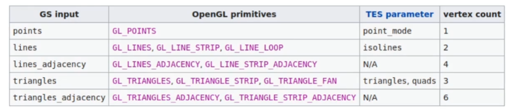
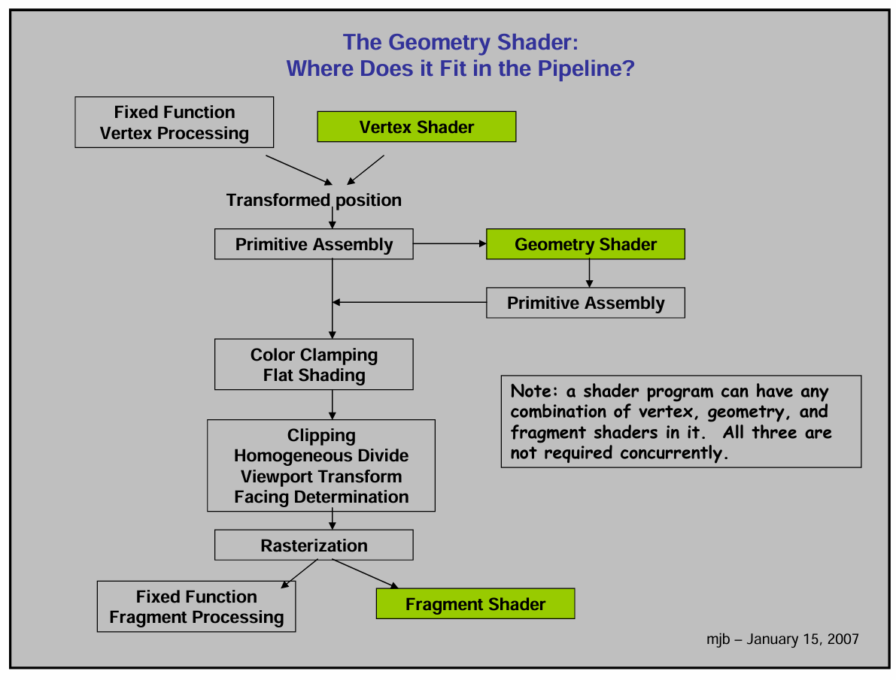

# 使用OpenGL绘制2D有宽度的线段

> 主要思路：使用Geometry Shader将GL_LINES_扩展为TRIANGLE_STRIP

## Geometry Shader

Geometry Shader是处于Vertex Shader之后，fragment shader之前的shader，用于在GPU上处理传输的**图元**，例如LINES,TRIANGLES，然后
再往后过光栅化，其实就是省掉了某些具有规律的定点的计算方式，但是这种方式也是存在着性能问题，至少每次在NSight Graphics上每个draw call都会在Geometry计算上警告性能问题

下面介绍一下Geometry Shader的编写方式

```glsl
#version 440 core

layout(lines) in;
layout(triangle_strip, max_vertices=4) out;
uniform int lineWidth;
uniform vec2 viewPortSize;

void main() {
   ...
}

```
在Geometry Shader中比较特殊的就是in和out的layout
```glsl
layout(lines) in;
layout(triangle_strip, max_vertices=4) out;
```
在in和out的layout中第一个参数就是图元的类型，这个图元类型和在调用draw call时的类型一致，in中的输入的图元的类型，out中的是输出图元的类型，
out中的max_vertices是经过geometry shader后最多输出多少个顶点。

<div align="center">

</div>

在经过geometry shader后由vertex shader输出的position就会失效，后续的所有动作都会从geometry shader开始执行

<div align="center">

</div>

在生成有宽度的线段时，在geometry shader中甚至还原到了屏幕坐标，但是相比于CPU端计算，geometry shader在图元级别是并行的。

## TODO

在绘制大量相似的数据时可以考虑实例化绘制相关内容
