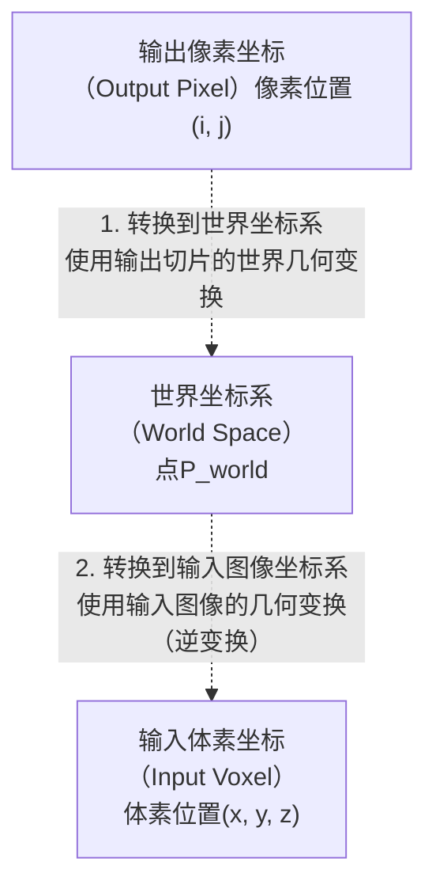

# 基于VTK的MPR实现


## Radiologist's view和Neuro-Surgeons's view

|视角|	观察方向	|图像朝向约定	|典型用途|
|---|------------|---------------|--------|
|Radiologist's view|	从患者脚侧往头侧看（即“从下往上看”）<br>（例如轴位图像是从足端向上看）|	图像显示为 患者面对你 <br>→ 左侧显示患者的右侧（R）<br>→ 右侧显示患者的左侧（L）|	放射诊断、阅片（PACS 系统默认）|
|Neuro-Surgeon's view	|从患者头侧往脚侧看（即“从上往下看”）<br>（例如站在患者头顶向下看）	|图像显示为 你面对患者 <br>→ 左侧显示患者的左侧（L）<br>→ 右侧显示患者的右侧（R）	|手术规划、导航、术中参考|

Radiologist's view为默认视角，也是DICOM中存储的默认视角LPS坐标系（这个坐标系不会用于可视化，即使使用左手系也是LAS），但是显示一般使用RAS坐标系，LAS和RAS就是x轴不同其他两个轴是相同的，也就是关于x平面镜像

## mitk中对于Geometry的管理
- SliceNavigationController
    - m_InputWorldTimeGeometry： 整体由mitkDataStorage计算得到的整体的geometry信息
    - slicedWorldGeometry 
    ```c++
    void SliceNavigationController::CreateWorldGeometry(bool top, bool frontside, bool rotated)
  {
    ...

    // initialize the viewplane
    SlicedGeometry3D::Pointer slicedWorldGeometry;
    BaseGeometry::ConstPointer currentGeometry;
    ...
    currentGeometry = m_InputWorldTimeGeometry->GetGeometryForTimeStep(selectedTimestep);
    ...
    if (AnatomicalPlane::Original == m_ViewDirection)
    {
      slicedWorldGeometry = dynamic_cast<SlicedGeometry3D*>(
        m_InputWorldTimeGeometry->GetGeometryForTimeStep(selectedTimestep).GetPointer());
      if (slicedWorldGeometry.IsNull())
      {
        slicedWorldGeometry = SlicedGeometry3D::New();
        slicedWorldGeometry->InitializePlanes(currentGeometry, AnatomicalPlane::Original, top, frontside, rotated);
        slicedWorldGeometry->SetSliceNavigationController(this);
      }
    }
    ...

    m_CreatedWorldGeometry = mitk::TimeGeometry::Pointer();
    if (nullptr != dynamic_cast<const mitk::ProportionalTimeGeometry*>(m_InputWorldTimeGeometry.GetPointer()))
    {
      const TimePointType minimumTimePoint = m_InputWorldTimeGeometry->TimeStepToTimePoint(0);
      const TimePointType stepDuration =
        m_InputWorldTimeGeometry->TimeStepToTimePoint(1) - minimumTimePoint;

      auto createdTimeGeometry = ProportionalTimeGeometry::New();
      createdTimeGeometry->Initialize(slicedWorldGeometry, inputTimeSteps);
      createdTimeGeometry->SetFirstTimePoint(minimumTimePoint);
      createdTimeGeometry->SetStepDuration(stepDuration);

      m_CreatedWorldGeometry = createdTimeGeometry;
    }
    ...
  }

  void SliceNavigationController::SendCreatedWorldGeometry()
  {
    if (!m_BlockUpdate)
    {
      this->InvokeEvent(GeometrySendEvent(m_CreatedWorldGeometry, 0));
    }
  }

  // 通过mitk::SliceNavigationController来设置geometry
  void mitk::BaseRenderer::SetGeometry(const itk::EventObject& geometrySendEvent)
    {
    const auto* sendEvent = dynamic_cast<const SliceNavigationController::GeometrySendEvent*>(&geometrySendEvent);

    if (nullptr == sendEvent)
    {
        return;
    }

    SetWorldTimeGeometry(sendEvent->GetTimeGeometry());
    }

    void mitk::BaseRenderer::SetWorldTimeGeometry(const mitk::TimeGeometry* geometry)
    {
        if (m_WorldTimeGeometry == geometry)
        {
            return;
        }

        m_WorldTimeGeometry = geometry;

        this->UpdateCurrentGeometries();
    }

    void mitk::BaseRenderer::UpdateCurrentGeometries()
    {
    ...

    auto slicedWorldGeometry =
        dynamic_cast<SlicedGeometry3D*>(m_WorldTimeGeometry->GetGeometryForTimeStep(m_TimeStep).GetPointer());
    if (slicedWorldGeometry != nullptr)
    {
        ...
        SetCurrentWorldGeometry(slicedWorldGeometry);
        SetCurrentWorldPlaneGeometry(slicedWorldGeometry->GetPlaneGeometry(m_Slice));
        ...
    }
    }
    ```

## 旋转矩阵的维护
## 纹理贴图

### 贴图平面Bounds计算

通过将bounding box的8个角点变换到PlaneGeometry的局部坐标系中,计算bounding box的12条边和PlaneGeometry相交情况确定PlaneGeometry的边界，确定相交的bounds:[$x_{min}$, $x_{max}$, $y_{min}$, $y_{max}$, 0, 0]，因为求的是和PlaneGeometry的相交点，而PlaneGeometry的局部坐标系定义在Z=0的平面上，所以$z_{min}$, $z_{max}$都是0

在计算完成PlaneGeometry之后的bounds后，形成vtkPlaneSource，然后将PlaneGeometry的indexToWorld矩阵赋予vtkPlaneSource所在的Actor即将Plane变换到指定位置

```c++
void mitk::ImageVtkMapper2D::GenerateDataForRenderer(mitk::BaseRenderer *renderer)
{
  ...
  localStorage->m_Reslicer->GetClippedPlaneBounds(sliceBounds);
  ...
  this->TransformActor(renderer);
  ...
}

bool mitk::ExtractSliceFilter::GetClippedPlaneBounds(double bounds[6])
{
  if (!m_WorldGeometry || !this->GetInput())
    return false;

  return this->GetClippedPlaneBounds(
    m_WorldGeometry->GetReferenceGeometry(), m_WorldGeometry, bounds);
}

bool mitk::ExtractSliceFilter::GetClippedPlaneBounds(const BaseGeometry *boundingGeometry,
                                                     const PlaneGeometry *planeGeometry,
                                                     double *bounds)
{
  bool b = mitk::PlaneClipping::CalculateClippedPlaneBounds(boundingGeometry, planeGeometry, bounds);

  return b;
}

static bool CalculateClippedPlaneBounds(const BaseGeometry *boundingGeometry,
                                        const PlaneGeometry *planeGeometry,
                                        double *bounds)
{
  // Clip the plane with the bounding geometry. To do so, the corner points
  // of the bounding box are transformed by the inverse transformation
  // matrix, and the transformed bounding box edges derived therefrom are
  // clipped with the plane z=0. The resulting min/max values are taken as
  // bounds for the image reslicer.
  const mitk::BoundingBox *boundingBox = boundingGeometry->GetBoundingBox();

  mitk::BoundingBox::PointType bbMin = boundingBox->GetMinimum();
  mitk::BoundingBox::PointType bbMax = boundingBox->GetMaximum();

  vtkSmartPointer<vtkPoints> points = vtkSmartPointer<vtkPoints>::New();
  if (boundingGeometry->GetImageGeometry())
  {
    points->InsertPoint(0, bbMin[0] - 0.5, bbMin[1] - 0.5, bbMin[2] - 0.5);
    points->InsertPoint(1, bbMin[0] - 0.5, bbMin[1] - 0.5, bbMax[2] - 0.5);
    points->InsertPoint(2, bbMin[0] - 0.5, bbMax[1] - 0.5, bbMax[2] - 0.5);
    points->InsertPoint(3, bbMin[0] - 0.5, bbMax[1] - 0.5, bbMin[2] - 0.5);
    points->InsertPoint(4, bbMax[0] - 0.5, bbMin[1] - 0.5, bbMin[2] - 0.5);
    points->InsertPoint(5, bbMax[0] - 0.5, bbMin[1] - 0.5, bbMax[2] - 0.5);
    points->InsertPoint(6, bbMax[0] - 0.5, bbMax[1] - 0.5, bbMax[2] - 0.5);
    points->InsertPoint(7, bbMax[0] - 0.5, bbMax[1] - 0.5, bbMin[2] - 0.5);
  }
  else
  {
    points->InsertPoint(0, bbMin[0], bbMin[1], bbMin[2]);
    points->InsertPoint(1, bbMin[0], bbMin[1], bbMax[2]);
    points->InsertPoint(2, bbMin[0], bbMax[1], bbMax[2]);
    points->InsertPoint(3, bbMin[0], bbMax[1], bbMin[2]);
    points->InsertPoint(4, bbMax[0], bbMin[1], bbMin[2]);
    points->InsertPoint(5, bbMax[0], bbMin[1], bbMax[2]);
    points->InsertPoint(6, bbMax[0], bbMax[1], bbMax[2]);
    points->InsertPoint(7, bbMax[0], bbMax[1], bbMin[2]);
  }

  vtkSmartPointer<vtkPoints> newPoints = vtkSmartPointer<vtkPoints>::New();

  vtkSmartPointer<vtkTransform> transform = vtkSmartPointer<vtkTransform>::New();
  transform->Identity();
  transform->Concatenate(planeGeometry->GetVtkTransform()->GetLinearInverse());

  transform->Concatenate(boundingGeometry->GetVtkTransform());

  transform->TransformPoints(points, newPoints);

  bounds[0] = bounds[2] = 10000000.0;
  bounds[1] = bounds[3] = -10000000.0;
  bounds[4] = bounds[5] = 0.0;

  LineIntersectZero(newPoints, 0, 1, bounds);
  LineIntersectZero(newPoints, 1, 2, bounds);
  LineIntersectZero(newPoints, 2, 3, bounds);
  LineIntersectZero(newPoints, 3, 0, bounds);
  LineIntersectZero(newPoints, 0, 4, bounds);
  LineIntersectZero(newPoints, 1, 5, bounds);
  LineIntersectZero(newPoints, 2, 6, bounds);
  LineIntersectZero(newPoints, 3, 7, bounds);
  LineIntersectZero(newPoints, 4, 5, bounds);
  LineIntersectZero(newPoints, 5, 6, bounds);
  LineIntersectZero(newPoints, 6, 7, bounds);
  LineIntersectZero(newPoints, 7, 4, bounds);

  if ((bounds[0] > 9999999.0) || (bounds[2] > 9999999.0) || (bounds[1] < -9999999.0) || (bounds[3] < -9999999.0))
  {
    return false;
  }
  else
  {
    // The resulting bounds must be adjusted by the plane spacing, since we
    // we have so far dealt with index coordinates
    const mitk::Vector3D planeSpacing = planeGeometry->GetSpacing();
    bounds[0] *= planeSpacing[0];
    bounds[1] *= planeSpacing[0];
    bounds[2] *= planeSpacing[1];
    bounds[3] *= planeSpacing[1];
    bounds[4] *= planeSpacing[2];
    bounds[5] *= planeSpacing[2];
    return true;
  }
}

```
### 纹理生成

```c++

void mitk::ImageVtkMapper2D::TransformActor(mitk::BaseRenderer *renderer)
{
  LocalStorage *localStorage = m_LSH.GetLocalStorage(renderer);
  // get the transformation matrix of the reslicer in order to render the slice as axial, coronal or sagittal
  vtkSmartPointer<vtkTransform> trans = vtkSmartPointer<vtkTransform>::New();
  vtkSmartPointer<vtkMatrix4x4> matrix = localStorage->m_Reslicer->GetResliceAxes();
  trans->SetMatrix(matrix);
  // transform the plane/contour (the actual actor) to the corresponding view (axial, coronal or sagittal)
  localStorage->m_ImageActor->SetUserTransform(trans);
  // transform the origin to center based coordinates, because MITK is center based.
  localStorage->m_ImageActor->SetPosition(-0.5 * localStorage->m_mmPerPixel[0], -0.5 * localStorage->m_mmPerPixel[1], 0.0);

  localStorage->m_ShadowOutlineActor->SetUserTransform(trans);
  localStorage->m_ShadowOutlineActor->SetPosition(-0.5 * localStorage->m_mmPerPixel[0], -0.5 * localStorage->m_mmPerPixel[1], 0.0);
}

```

### 纹理裁剪

使用和PlaneGeometry相同的裁剪方式得到纹理的bounds
```c++
void mitk::ImageVtkMapper2D::GenerateDataForRenderer(mitk::BaseRenderer *renderer)
{
  ...
  {
  double textureClippingBounds[6];
  for (auto &textureClippingBound : textureClippingBounds)
  {
    textureClippingBound = 0.0;
  }
  // Calculate the actual bounds of the transformed plane clipped by the
  // dataset bounding box; this is required for drawing the texture at the
  // correct position during 3D mapping.
  mitk::PlaneClipping::CalculateClippedPlaneBounds(image->GetGeometry(), planeGeometry, textureClippingBounds);

  textureClippingBounds[0] = static_cast<int>(textureClippingBounds[0] / localStorage->m_mmPerPixel[0] + 0.5);
  textureClippingBounds[1] = static_cast<int>(textureClippingBounds[1] / localStorage->m_mmPerPixel[0] + 0.5);
  textureClippingBounds[2] = static_cast<int>(textureClippingBounds[2] / localStorage->m_mmPerPixel[1] + 0.5);
  textureClippingBounds[3] = static_cast<int>(textureClippingBounds[3] / localStorage->m_mmPerPixel[1] + 0.5);

  // clipping bounds for cutting the image
  localStorage->m_LevelWindowFilter->SetClippingBounds(textureClippingBounds);
}
  ...
}
```

### 平面(Z=0)和直线相交计算

在上面的bounds计算过程中有一个很重要的过程就是计算直线和平面的交点，下面推导计算公式

将直线参数化为
$$
P(t) = P_1 + t*(P_2 - P_1)
$$

转换为各个分量为
$$
\left\{
\begin{aligned}
x(t) &= x_1 + t(x_2 - x_1) \\
y(t) &= y_1 + t(y_2 - y_1) \\
z(t) &= z_1 + t(z_2 - z_1)
\end{aligned}
\right.
$$

由于想要求的点都在z=0平面上，所以使得z(t) = 0,
$$
z(t) = 0 \Rightarrow z_1 + t(z_2 - z_1) = 0 \Rightarrow t = \frac{z_1}{z_1-z_2}
$$

带入x(t)和y(t)得
$$
\begin{aligned}
x(t) &= x_1 + \frac{z_1}{z_1-z_2}(x_2-x_1) = \frac{x_1z_2-x_2z_1}{z_2-z_1} \\
y(t) &= y_1 + \frac{z_1}{z_1-z_2}(y_2-y_1) = \frac{z_2y_1-y_2z_1}{z_2-z_1}
\end{aligned}
$$


## 最简单的流程
<div align="center">



</div>

在mitk中所有的变换都是在世界坐标系下完成的，例如从A的位置计算B中的元素，需要首先将A使用IndexToWorld矩阵变换到世界坐标系下得到A'，然后将其视为B的一部分，比如想要使用A取得B的像素或者体素，再次使用B的WorldToIndex矩阵将A'变换为在B的局部坐标系下得到A''，再对A''中的每个元素计算B中的值，即可使用A对B进行采样

## 采样的各向同性和各向异性

在医学图像插值过程中默认是各向同性，也就是每个维度的间距都近似相同，否则会出现某一方向采样不足模糊。

例如spacing=[0.1,0.1,5]，在x和y方向上每0.1mm采样一个点，而在z方向上没5mm才能采样一个点，(0, 5)之间没有数据完全依赖插值，所以会造成模糊，所以数据一般要呈现各向同性，各向同性指的是spacing=[xs, ys, zs], xs=ys=zs

