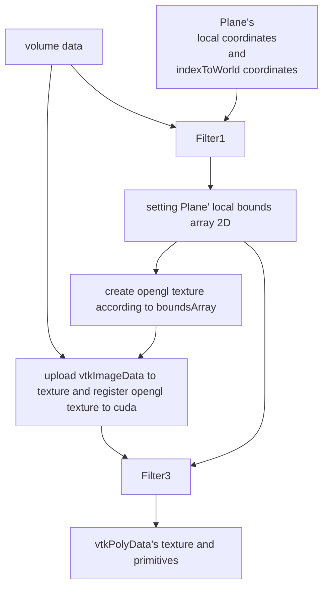

# 尝试将cuda slice集成到vtk中

## 一、Filters的流程

```mermaid
graph TD
vtkImageData["volume data"] --> Filter1 
%% Filter1: PlaneLocalBoundsFilter
Plane["Plane's <br> local coordinates <br> and  <br> indexToWorld coordinates"] --> Filter1
Filter1 --> boundsArray["setting Plane' local bounds array 2D"]
vtkImageData --> Filter2["upload vtkImageData to texture and register opengl texture to cuda"]
boundsArray--> createOpenGLTexture["create opengl texture according to boundsArray"]
createOpenGLTexture --> Filter2
Filter2 --> Filter3
boundsArray --> Filter3
Filter3 --> vtkPolyData["vtkPolyData's texture and primitives"]
```

